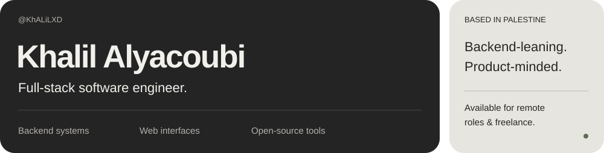
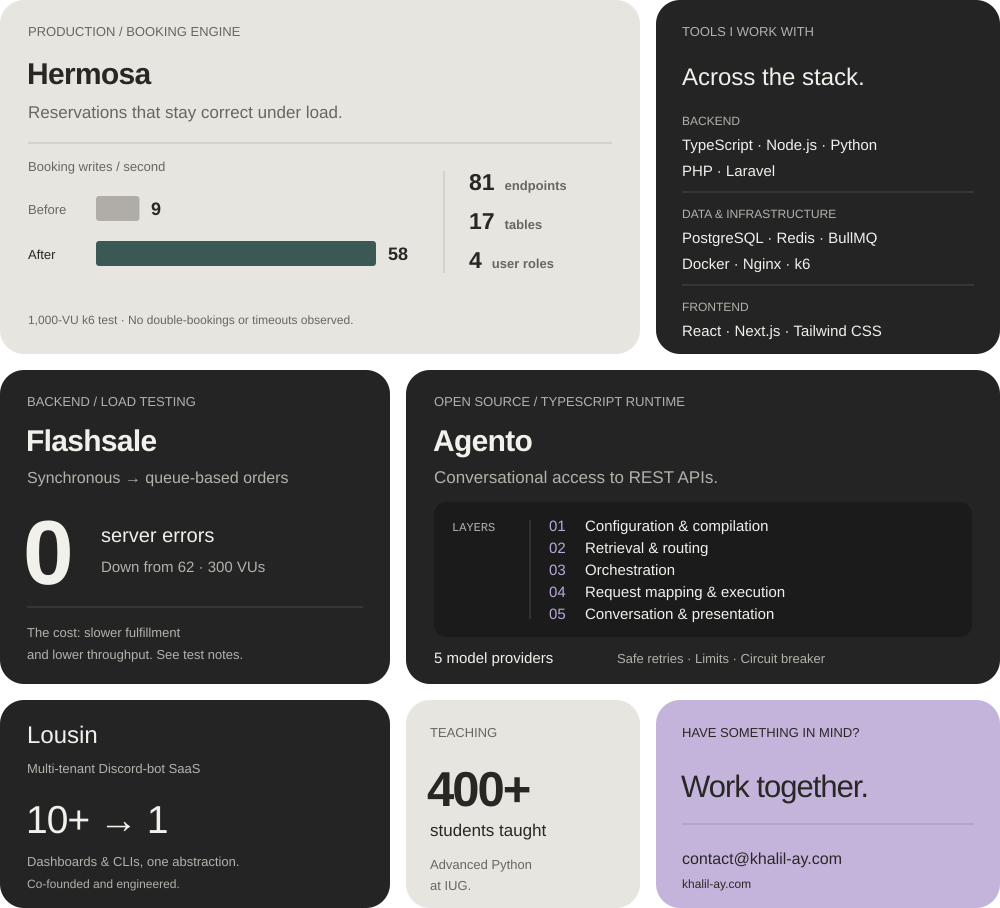

<!-- Artwork is editable SVG. See assets/EDITING.md for a short editing guide. -->

  <a href="https://khalil-ay.com">Portfolio</a> &nbsp; · &nbsp;
  <a href="https://khalil-ay.com/works">My works</a> &nbsp; · &nbsp;
  <a href="https://linkedin.com/in/khalil-ay">LinkedIn</a> &nbsp; · &nbsp;
  <a href="mailto:contact@khalil-ay.com">Contact</a>

  <a href="https://hermosaksa.net">Hermosa</a> &nbsp; · &nbsp;
  <a href="https://github.com/KhALiLXD/Backend-Of-thrones">Flashsale source</a> &nbsp; · &nbsp;
  <a href="https://khalil-ay.com/works/18">Agento</a> &nbsp; · &nbsp;
  <a href="https://khalil-ay.com/works">All projects</a>

<strong>Projects &amp; test notes</strong>

- **Hermosa:** A production salon booking platform with 81 REST endpoints, 17 tables, and four user roles. Booking writes increased from 9 to 58 per second in a 1,000-VU k6 test; no double-bookings or timeouts were observed in that test.
- **Flash-sale system:** A comparison of synchronous and queue-based order paths. At the same 300-VU peak load, server errors fell from 62 to zero. The queue-based run recorded zero failed requests out of 108,844 and no stranded stock. The tradeoff: p95 fulfillment increased from 5.0 s to 8.1 s, while throughput decreased from 72.9 to 32.5 requests/s.
- **Agento:** An open-source runtime on npm that brings conversational access to REST APIs. Includes approvals bound to the exact write call, replay prevention, timeouts, size limits, circuit breakers, and safe retries across five model providers.
- **Lousin:** A co-founded, multi-tenant Discord-bot SaaS that consolidated more than ten dashboards and CLIs into one abstraction layer.
- **Teaching:** Advanced Python instruction for 400+ students at the Islamic University of Gaza.

Flash-sale figures come from a closed-model k6 run against a **mock payment gateway**. These are results from specific tests, not production guarantees. Methodology, known defects, and threats to validity are documented in the flash-sale repository’s `ANALYSIS_REPORT.md`.

